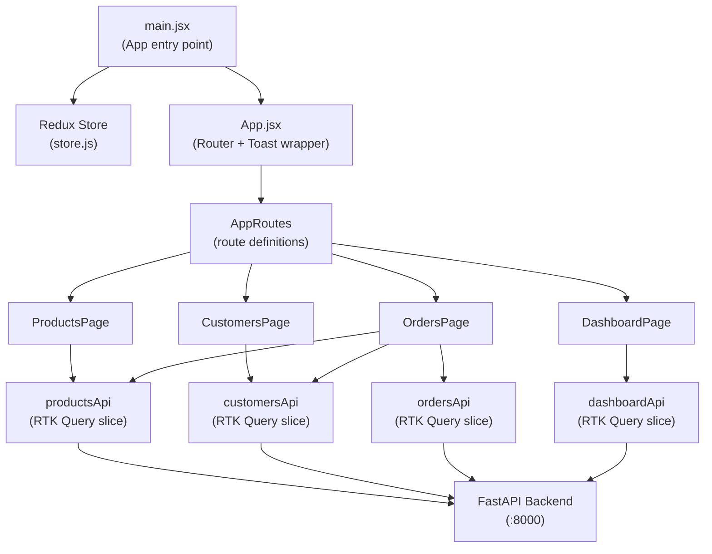
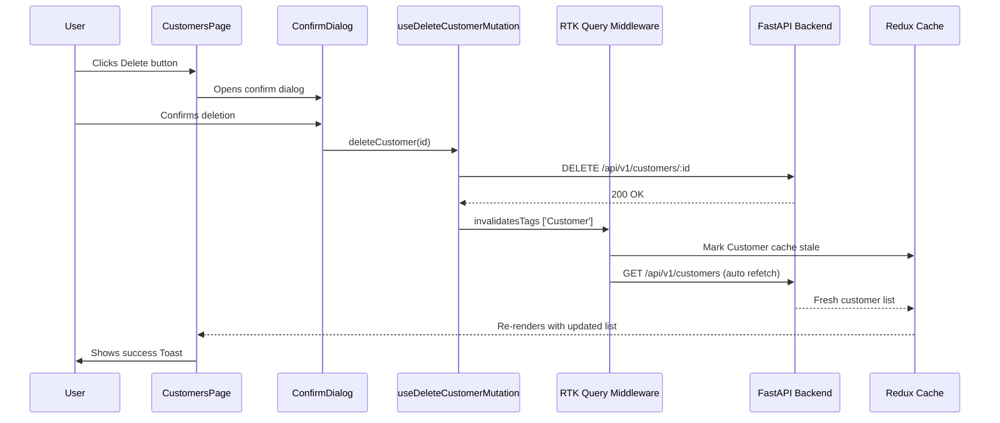
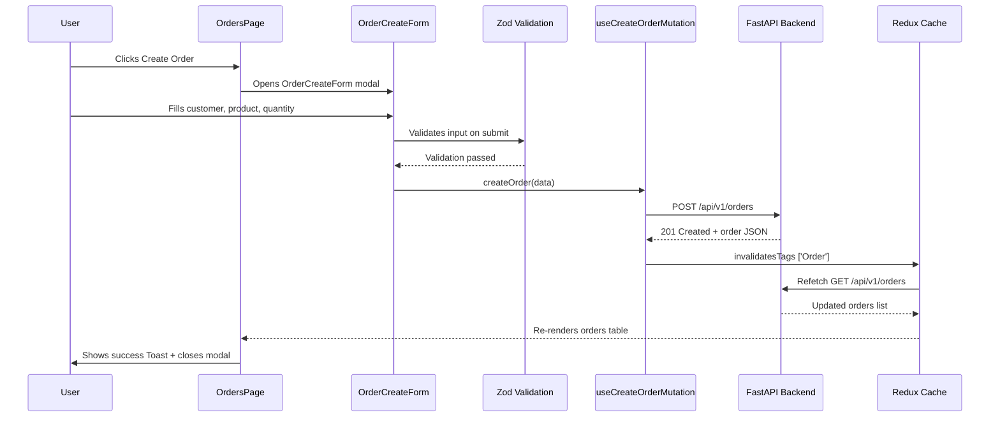
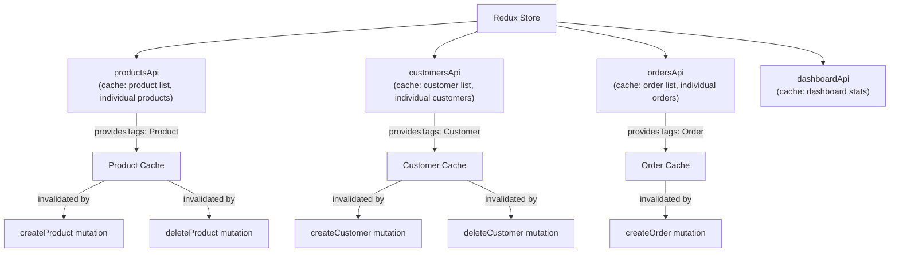
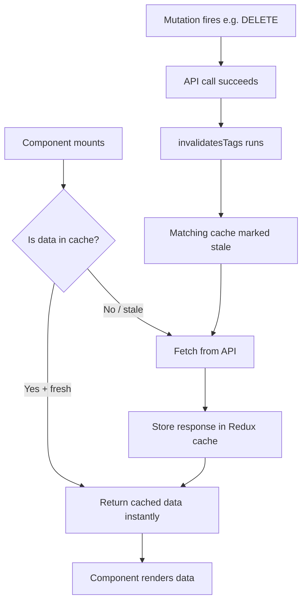
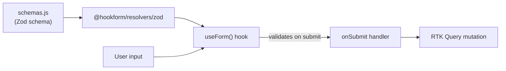

# Frontend Documentation

## Overview

The frontend is a **React + Vite** single-page application (SPA) for the Inventory & Order Management System. It uses Redux Toolkit Query for data fetching and caching, React Router for navigation, Tailwind CSS for styling, and Zod for form validation.

---

## Architecture



---

## Scenario Flow: Deleting a Customer



---

## Scenario Flow: Creating an Order



---

## Folder Structure

```
frontend/
├── public/
│   ├── favicon.svg                   (browser tab icon)
│   └── icons.svg                     (SVG sprite for icons)
├── src/
│   ├── main.jsx                      (app entry - mounts React, wraps with Redux Provider)
│   ├── App.jsx                       (root component - sets up BrowserRouter and ToastProvider)
│   ├── index.css                     (global CSS, Tailwind base imports)
│   ├── App.css                       (app-level scoped styles)
│   │
│   ├── app/
│   │   └── store/
│   │       └── store.js              (Redux store - registers all API reducers and middleware)
│   │
│   ├── features/                     (RTK Query API slices - one per domain)
│   │   ├── products/
│   │   │   ├── productsApi.js        (defines product endpoints + auto-generated hooks)
│   │   │   └── productsApi.test.js   (unit tests for products API)
│   │   ├── customers/
│   │   │   ├── customersApi.js       (defines customer endpoints + auto-generated hooks)
│   │   │   └── customersApi.test.js  (unit tests for customers API)
│   │   ├── orders/
│   │   │   ├── ordersApi.js          (defines order endpoints + auto-generated hooks)
│   │   │   └── ordersApi.test.js     (unit tests for orders API)
│   │   └── dashboard/
│   │       └── dashboardApi.js       (defines dashboard stats endpoint + hook)
│   │
│   ├── pages/                        (full page components - one per route)
│   │   ├── DashboardPage.jsx         (shows stat cards and low stock table)
│   │   ├── ProductsPage.jsx          (product list, create/edit/delete product)
│   │   ├── CustomersPage.jsx         (customer list, create/delete customer)
│   │   ├── OrdersPage.jsx            (order list, create order, view order details)
│   │   └── NotFoundPage.jsx          (404 fallback page)
│   │
│   ├── components/                   (reusable UI components used across pages)
│   │   ├── StatCard.jsx              (dashboard metric card - total orders, revenue etc)
│   │   ├── LowStockTable.jsx         (table showing products below stock threshold)
│   │   ├── ProductForm.jsx           (form for creating and editing a product)
│   │   ├── CustomerForm.jsx          (form for creating a customer)
│   │   ├── OrderCreateForm.jsx       (multi-step form for creating an order)
│   │   ├── OrderDetailModal.jsx      (modal showing full order breakdown)
│   │   ├── ConfirmDialog.jsx         (reusable "are you sure?" confirmation dialog)
│   │   ├── Toast.jsx                 (notification system - success/error popups)
│   │   ├── ThemeToggle.jsx           (dark/light mode toggle button)
│   │   ├── EmptyState.jsx            (shown when a list has no data)
│   │   ├── ErrorState.jsx            (shown when an API call fails)
│   │   └── LoadingSkeleton.jsx       (placeholder UI shown while data loads)
│   │
│   ├── hooks/
│   │   ├── useTheme.js               (custom hook - manages dark/light mode state)
│   │   └── useTheme.test.js          (tests for useTheme hook)
│   │
│   ├── lib/
│   │   ├── schemas.js                (Zod validation schemas for product and customer forms)
│   │   ├── schemas.test.js           (tests for Zod schemas)
│   │   └── utils.js                  (utility functions - className merging etc)
│   │
│   ├── utils/
│   │   ├── orderUtils.js             (order-specific helpers - price formatting, totals)
│   │   └── orderUtils.test.js        (tests for order utilities)
│   │
│   ├── layouts/                      (shared page layout wrappers)
│   ├── routes/                       (React Router route definitions)
│   └── test/
│       └── setup.js                  (vitest global test setup - jest-dom matchers)
│
├── index.html                        (HTML shell - Vite injects the React bundle here)
├── vite.config.js                    (Vite config - @ alias, plugins)
├── vitest.config.js                  (Vitest test runner config)
├── postcss.config.js                 (PostCSS config for Tailwind)
├── eslint.config.js                  (ESLint rules)
├── package.json                      (dependencies and npm scripts)
├── Dockerfile                        (two-stage build: Node build + Nginx serve)
└── .env.example                      (example environment variables)
```

---

## Dependency Libraries

### Runtime Dependencies

| Package | Purpose |
|---|---|
| `react` + `react-dom` | Core UI library |
| `react-router-dom` | Client-side routing between pages |
| `@reduxjs/toolkit` | Redux store + RTK Query for data fetching/caching |
| `react-redux` | Connects React components to Redux store |
| `react-hook-form` | Form state management and submission handling |
| `@hookform/resolvers` | Bridges Zod schemas with react-hook-form |
| `zod` | Schema-based form validation |
| `lucide-react` | SVG icon components |
| `tailwindcss` | Utility-first CSS framework |
| `@tailwindcss/vite` | Vite plugin for Tailwind CSS v4 |
| `@radix-ui/react-dialog` | Accessible modal/dialog primitives |
| `@radix-ui/react-alert-dialog` | Accessible confirmation dialog |
| `@radix-ui/react-select` | Accessible dropdown select |
| `@radix-ui/react-toast` | Accessible toast notification |
| `@radix-ui/react-label` | Accessible form label |
| `@radix-ui/react-slot` | Component composition utility |
| `class-variance-authority` | Manages conditional CSS class variants |
| `clsx` + `tailwind-merge` | Merges Tailwind class names without conflicts |
| `axios` | HTTP client (used alongside RTK Query for some requests) |
| `fast-check` | Property-based testing library |

### Dev Dependencies

| Package | Purpose |
|---|---|
| `vite` | Build tool and dev server |
| `vitest` | Unit test runner (Vite-native) |
| `@testing-library/react` | React component testing utilities |
| `@testing-library/user-event` | Simulates real user interactions in tests |
| `@testing-library/jest-dom` | Custom DOM matchers for assertions |
| `jsdom` | DOM simulation environment for tests |
| `eslint` | Code linting |

---

## Redux Store Architecture



---

## RTK Query Cache Flow



---

## Environment Variables

Copy `frontend/.env.example` to `frontend/.env`:

```env
VITE_API_URL=http://localhost:8000
```

This is the base URL for all API calls. It gets baked into the JS bundle at build time by Vite.

---

## The `@` Path Alias

`@` is configured in `vite.config.js` to point to `src/`:

```js
resolve: {
  alias: { '@': path.resolve(__dirname, './src') }
}
```

So instead of messy relative paths:
```js
import { store } from '../../../app/store/store'
```

You write:
```js
import { store } from '@/app/store/store'
```

---

## Running the Frontend

```bash
# With Docker (recommended)
docker compose up

# Locally
cd frontend
npm install
npm run dev        # dev server at http://localhost:5173
npm run build      # production build
npm run test       # watch mode tests
npm run test:run   # single run tests
```

---

## Form Validation Flow

Forms use `react-hook-form` + `zod` together:



Schemas live in `src/lib/schemas.js` and are shared between the form and tests.
